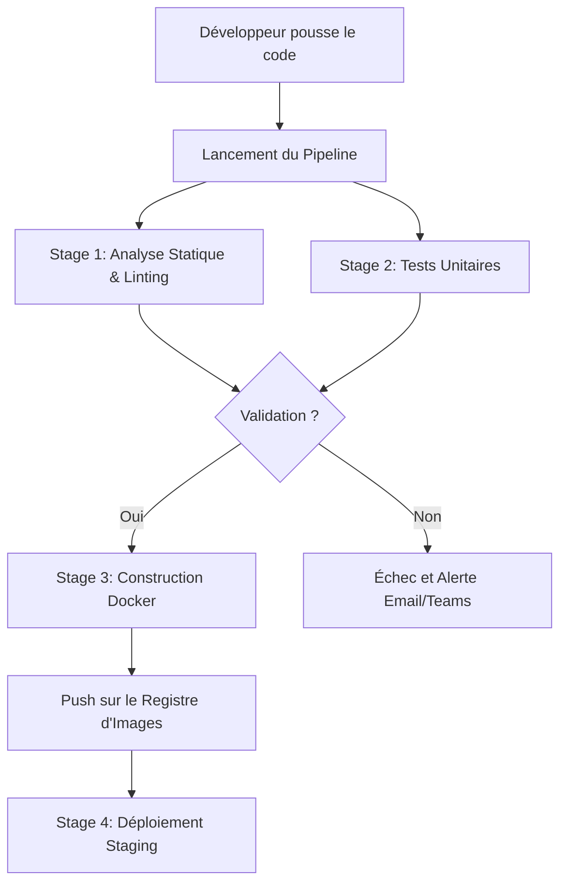

# Pipeline d'Intégration et Déploiement Continus — CI/CD

Ce document décrit l'architecture et les étapes d'automatisation des tests et du déploiement de la solution **CSM-GIAS Resto+**.

---

## 🛠️ Outils & Technologies CI/CD
- **Hébergement du Code** : Dépôt Git d'entreprise (GitLab ou GitHub).
- **Moteur d'Intégration** : GitHub Actions / GitLab CI.
- **Registre d'Images** : Docker Registry privé d'entreprise.

---

## 🔄 Flux de Travail (Workflow CI)

---

## ⚙️ Configuration du Pipeline de Staging (FastAPI)
1. **Linting** : Validation du style de code Python via `flake8` ou `black`.
2. **Tests** : Exécution automatique de la suite de tests unitaires via `pytest`.
3. **Build** : Construction de l'image Docker multi-stage optimisée pour la production.
4. **Push** : Envoi de l'image construite vers le registre d'images privé avec un tag unique basé sur le commit Git.
5. **Deploy** : Déploiement automatique sur le serveur de Staging local via un script SSH automatisé ou Kubernetes.
